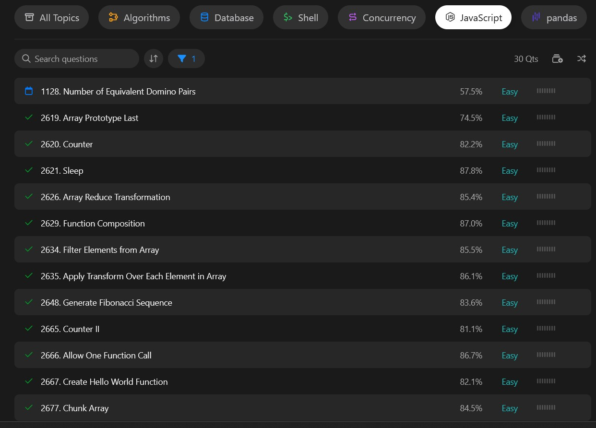
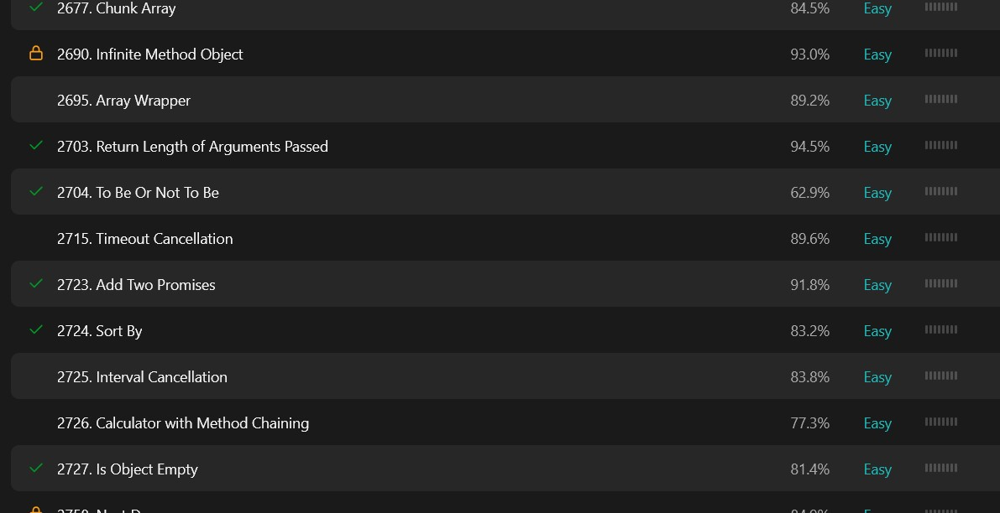
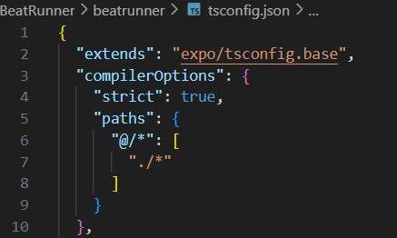
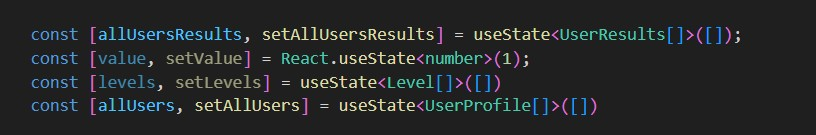
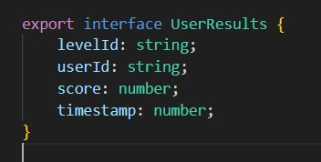
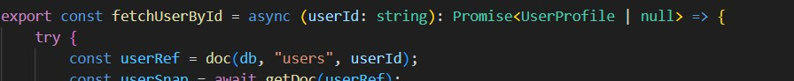

# Typescript
Seminaarityön työksi päätinkin valita **Typescriptin** koska uskon sen olevan hyvä aihe ymmärtää paremmin.
Käytimme Ohjelmistoprojekti 2 kurssin projektissa **Beatrunner** Typescriptiä joten pääsin harjoittelemaan sitä ihan urakalla koska en ollut sitä aikaisemmin käyttänyt. Tein myös LeetCode sivustolla Typescriptillä kirjoitettuja harjoitustehtäviä, hioakseni taitoja myös projektin ulkopuolella.

## LeetCode
Päädyin LeetCode sivustolle jossa annettiin eri tasoisia koodaus haasteita joissa pääsi sitten hiomaan omia taitojaan ja onnistuttuaan näkemään myös muiden ratkaisuja. Sivuston käyttäjät voivat kirjoittaa apuviestejä ongelman ratkaisemiseen sekä yksityiskohtaisia selityksiä missä avataan mitä pitää tietää ongelmasta ja mitä pitää saavuttaa jotta ongelma ratkeaa.



Tehdessäni tehtäviä sain myös hiottua ymmärrystäni eri funktioiden toimintaperjaatteista kun luin muiden käyttäjien kirjoittamia ohje sivuja.



Esimerkkinä sain ymmärrystä siitä miten **true** ja **truthy** arvot eroavat

```
if(item == true){} ja if(item){}
//Ensimmäinen tarkistaa onko item true ja toinen tarkistaa onko item hyväksyttävä arvo
```

## Ohjelmistoprojekti 2 "Beatrunner" Typescript
Päätimme projektin alussa käyttää sovellutuksessamme Typescriptiä sen ollessa hyvä oppimismahdollisuus.



Opin nopeasti käyttämään typescriptiä ja totesin sen olevan hyvä työkalu joka vähensi koodauksen aikana tulevia virheitä kun koodi herjaa puuttuvista tai vajavaisista tyypeistä tai ristiriitaisista tietotyypeistä mennessä tai palautuessa.



Tyypityksellä voimme olla varmempia siitä että erinnäiset funktiot ottaa ja palauttaa tiedon halutussa muodossa eikä tietomuoto pääse muuttumaan isommankaan kokonaisuuden sisällä.



Tiedosto kohtaiset Interfacet varmistivat että hakiessa, emme hae ylimääräistä tietoa mikäli haun mukana voisi tulla jotain sellaista mitä ei ehkä haluta tuoda.



Oli mielenkiintoista huomata että jotkut funktiot tarvitsivat useamman tyypin palautuvalle arvolle toimiakseen oikein vaikkapa virhetilanteessa.

Toki omatekoisten tyyppien lisäksi valmiita tyyppejä on suunnaton määrä, esimerkiksi **TextStyle** jolla oli monipuoliset tyypitykset
```
const getColorForDifficulty = (difficulty: string): TextStyle => {

```
<details><summary>Opin samalla ...</summary>

Kirjoittamaan Markdown tiedoston syntaxeja.

</details>
